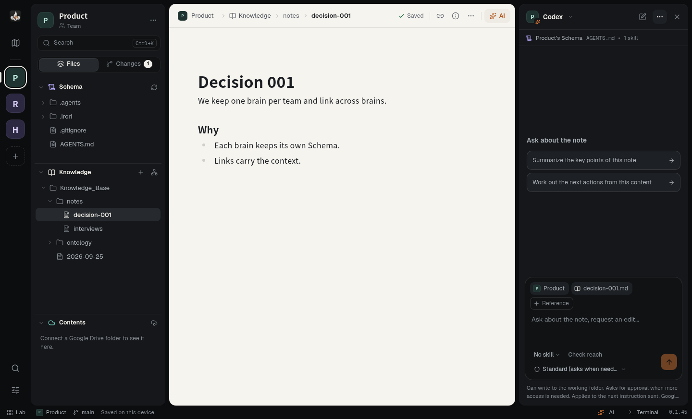
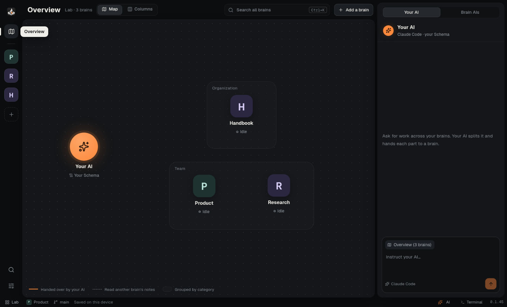

<div align="center">


# irori

**From notes to the next piece of work.**

A desktop app that brings together the notes where your knowledge lives and the local AI agents that carry the work forward.

[日本語](README.md) | **English**

<a href="https://del-taiseiozaki.github.io/irori/"></a>

[](https://github.com/DeL-TaiseiOzaki/irori/releases)
[](https://github.com/DeL-TaiseiOzaki/irori/actions/workflows/app.yml)
[](LICENSE)
[](#download)

[Download](https://del-taiseiozaki.github.io/irori/) ·
[Release notes](https://github.com/DeL-TaiseiOzaki/irori/releases) ·
[Getting started](#getting-started) ·
[Feedback](#feedback) ·
[Contributing](#contributing)



</div>

---

irori is a **knowledge IDE / ADE** for work that starts from Markdown notes.

Open a folder of notes as a **brain** (a knowledge base) to edit notes, read materials, keep history in Git and reach Google Drive files in one window. Then run the **Claude Code, Codex, OpenCode or Pi** already installed on your computer inside that brain, and ask it to carry the note forward.

Your notes are always ordinary Markdown files in your own folder. The agents use each CLI's own sign-in and settings, so irori needs no account or API key of its own.

## Download

Get the installer from the **[download site](https://del-taiseiozaki.github.io/irori/)**.

| Platform | File |
| --- | --- |
| **Windows 11** (x64) | Installer `.exe` |
| **macOS** (Apple silicon) | Disk image `.dmg` |

- irori is a **testing preview** without a distribution signature.
  - Windows warns that the publisher cannot be verified.
  - macOS blocks the first launch. Open **System Settings → Privacy & Security** and press **Open Anyway** once.
- Once installed, irori tells you when a new version is out. Press **Update and restart** to update.
- Windows on ARM and Intel Macs are not supported. On Linux, run from source ([development guide](docs/DEVELOPMENT.md)).

## Getting started

1. **Prepare.** Install [Git](https://git-scm.com/downloads). To use AI, also install and sign in to the CLI you want (`claude` / `codex` / `opencode` / `pi`). Writing notes needs no CLI.
2. **Add a brain.** On the start screen, choose a folder with **Open a KB folder**, or clone a repository with **Clone from GitHub**. Existing files stay where they are.
3. **Make a workspace.** Tick the brains you want and press **Create workspace**. Personal, team and organization brains combine freely.
4. **Write, then ask.** Open a note, write, and use **Ask AI** at the top right to hand the next step to an agent. When an agent asks for permission, the request appears in the panel.

## Features

**Brains and workspaces**
- A brain is organized in three layers: **Schema** (instructions and skills for AI), **Knowledge** (notes) and **Contents** (materials).
- The **Overview** shows the workspace's brains as a map or as columns. Search also runs across every brain.
- Each brain has its own name, category, icon and colour.

**Notes**
- A what-you-see Markdown editor that saves automatically. Pasted images go to `_assets/` next to the note.
- Follow relative links and list the notes that link here (backlinks). Renaming or moving a note rewrites the links to it.
- **Today's note** opens at a set place, from a set template.
- CSV opens as a table, and an ontology as a hierarchy or a graph.

**AI agents**
- **Brain AIs**: Claude Code, Codex, OpenCode and Pi start inside a brain, with that brain's Schema loaded. Several brains' AIs can run at once.
- **Your AI**: ask for work that spans brains. It splits the request by brain, hands each part to that brain's AI and reports back. It runs on Claude Code for now.
- Permissions follow each CLI's settings. For Claude Code and Codex, choose standard (asks when needed) or full access.
- Instructions can be queued while an agent works. Conversations survive a restart.

**Materials**
- PDF, Word (.docx), PowerPoint (.pptx), spreadsheets such as Excel (.xlsx/.xlsm/.xls/.ods) and images open in the window, without switching apps. They are view only; edit them in their own app.
- Connect a Google Drive folder as a brain's Contents. irori and the brain's AI can both edit it, and changes are sent to Drive. Windows needs [WinFsp](https://winfsp.dev/rel/).

**Records and tools**
- The **Changes** tab shows diffs, commits and history. irori never force-overwrites and never stashes on its own.
- A built-in terminal opens in the brain's folder.
- Switch the theme (Match system, Hearth, Light, Dark), the Markdown font and the interface language (日本語 / English).

<div align="center">

</div>

## Project status

irori is a **testing preview**. Changes merged into `main` are published as a preview right away.

- Acceptance on real Windows 11 and macOS devices is ongoing: installation, Japanese input, CLI integration and Google Drive. Start with a disposable folder or a copy.
- Distribution signing (Windows signing, Apple Developer ID and notarization) is not in place yet.

See [STATUS](docs/STATUS.md) for progress and [ACCEPTANCE](docs/ACCEPTANCE.md) for what has been confirmed.

## Feedback

- Report problems and requests in [GitHub Issues](https://github.com/DeL-TaiseiOzaki/irori/issues).
- Include the version shown in the app, your OS and the exact message.
- Do not post note contents, credentials or OAuth URLs.

## Contributing

Running from source, verification and the design records are in the **[development guide (docs/DEVELOPMENT.md)](docs/DEVELOPMENT.md)**.

```sh
git clone https://github.com/DeL-TaiseiOzaki/irori.git
cd irori
npm ci
npm run setup:electron
npm run build
npm start
```

- Requires Node.js 24.15 or later (24.x), or 26 or later.
- The contributor contract is [AGENTS.md](AGENTS.md).
- To continue development, start from [HANDOFF](docs/HANDOFF.md).

## Related projects

- [irori-templete](https://github.com/DeL-TaiseiOzaki/irori-templete): the recommended template for a brain (knowledge base) used in irori.

## License

[MIT License](LICENSE). Dependencies follow their own licences ([THIRD_PARTY_NOTICES](docs/THIRD_PARTY_NOTICES.md)).
