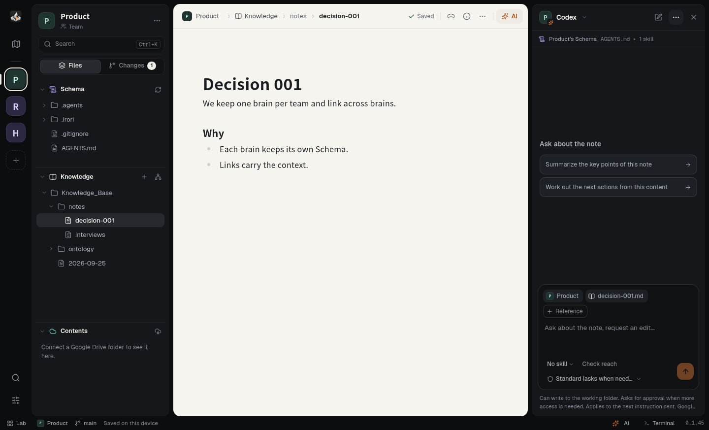
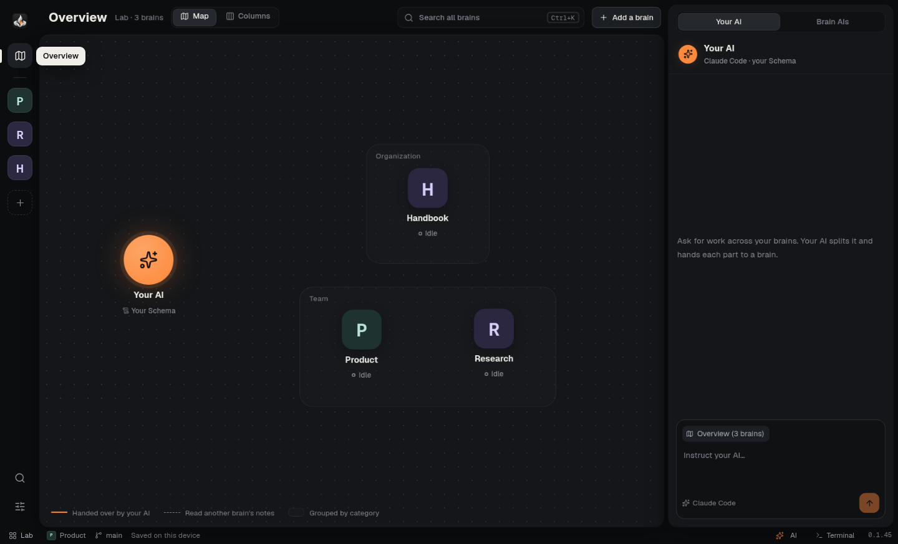

<div align="center">


# irori

**From notes to the next piece of work.**

A desktop app that brings together the notes where your knowledge lives and the local AI agents that carry the work forward.

[日本語](README.md) | **English**

<a href="https://del-taiseiozaki.github.io/irori/"></a>

[](https://github.com/DeL-TaiseiOzaki/irori/releases)
[](https://github.com/DeL-TaiseiOzaki/irori/actions/workflows/app.yml)
[](LICENSE)
[](#download)

[Download](https://del-taiseiozaki.github.io/irori/) ·
[Documentation](https://del-taiseiozaki.github.io/irori/docs/en/) ·
[Release notes](https://github.com/DeL-TaiseiOzaki/irori/releases) ·
[Getting started](#getting-started) ·
[Feedback](#feedback) ·
[Contributing](#contributing)



</div>

---

irori is a **knowledge IDE / ADE** for work that starts from Markdown notes.

Open a folder of notes as a **hibachi** (a knowledge base, formerly a brain) to edit notes, read materials, keep history in Git and reach Google Drive files in one window. Then run the **Claude Code, Codex, OpenCode, Pi or Hermes Agent** already installed on your computer inside that hibachi, and ask it to carry the note forward.

Your notes are always ordinary Markdown files in your own folder. The agents use each CLI's own sign-in and settings, so irori needs no account or API key of its own.

## Download

Get the installer from the **[download site](https://del-taiseiozaki.github.io/irori/)**.

| Platform | File |
| --- | --- |
| **Windows 11** (x64) | Installer `.exe` |
| **macOS** (Apple silicon) | Disk image `.dmg` |

- irori is a **testing preview** without a distribution signature.
  - Windows warns that the publisher cannot be verified.
  - macOS blocks the first launch. Open **System Settings → Privacy & Security** and press **Open Anyway** once.
- Once installed, irori tells you when a new version is out. Press **Update and restart** to update.
- Windows on ARM and Intel Macs are not supported. On Linux, run from source ([development guide](docs/DEVELOPMENT.md)).

## Getting started

1. **Prepare.** Install [Git](https://git-scm.com/downloads). To use AI, also install and sign in to the CLI you want (`claude` / `codex` / `opencode` / `pi`). Writing notes needs no CLI.
2. **Add a hibachi.** On the start screen, choose a folder with **Open a KB folder**, or clone a repository with **Clone from GitHub**. Existing files stay where they are.
3. **Make a workspace.** Tick the hibachis you want and press **Create workspace**. Personal, team and organization hibachis combine freely.
4. **Write, then ask.** Open a note, write, and use **Ask AI** at the top right to hand the next step to an agent. When an agent asks for permission, the request appears in the panel.

## Features

**Hibachis and workspaces**
- A hibachi is organized as **Knowledge** (notes) and **Contents** (materials). Turning the hibachi agent on (**Settings → Agents**) also shows **Schema** (instructions and skills for AI).
- **irori mode** (formerly the Overview) shows the workspace's hibachis as a map or as columns. Search also runs across every hibachi.
- Each hibachi has its own name, category, icon and colour.

**Notes**
- A what-you-see Markdown editor that saves automatically. Pasted images go to `_assets/` next to the note.
- Follow relative links and list the notes that link here (backlinks). Renaming or moving a note rewrites the links to it.
- **Today's note** opens at a set place, from a set template.
- CSV opens as a table, and an ontology as a hierarchy or a graph.

**AI agents**
- The AI pane beside the page holds any number of conversations side by side and widens freely. Hide the page to show only the agents.
- **hibachi agent** (a hibachi's AI, optional): Claude Code, Codex, OpenCode, Pi and Hermes Agent start inside a hibachi, with that hibachi's Schema loaded. Several hibachi agents can run at once. Pick a model from the list the installed CLI gives (type one in for Hermes Agent).
- **irori agent** (formerly "your AI"): in irori mode, ask for work that spans hibachis, on any of these CLIs. It splits the request by hibachi and hands each part to that hibachi's hibachi agent: on Claude Code, Codex and OpenCode a sub-agent (`hibachi-<name>`) that irori defines, on Pi and Hermes Agent a `hibachi` command irori provides for the request. It reports back. Like a hibachi agent it starts in full access, and its own Schema is edited with the same settings.
- Permissions follow each CLI's settings. A hibachi agent starts in full access where the CLI offers it; switch to standard (the CLI's settings, asking when needed) at any time.
- Each hibachi and the irori agent keep any number of whole conversations on this PC, with **新しい会話** and a **履歴** list (rename, pin, archive, delete). Instructions can be queued while an agent works, and survive a restart ([CONVERSATIONS](docs/CONVERSATIONS.md)).
- **Routines**: open **Routines** in the left rail, between irori mode and the hibachis, to configure JavaScript, manage secrets, and run a job you defined with one button. A routine is a folder with `routine.yaml` (in the irori agent's `routines/` or a hibachi's `.irori/routines/`) that lists programs to run and instructions for agents, in order. irori shows its files before the first run and after any change ([ROUTINES](docs/ROUTINES.md)).

**Materials**
- PDF, Word (.docx), PowerPoint (.pptx), spreadsheets such as Excel (.xlsx/.xlsm/.xls/.ods) and images open in the window, without switching apps. They are view only; edit them in their own app.
- Connect a folder that Google Drive, Dropbox, Box, iCloud or OneDrive keeps in sync as a hibachi's Contents. irori and the hibachi agent can both edit it. For Google Drive, use [Google Drive for desktop](https://www.google.com/drive/download/).

**Records and tools**
- The **Changes** tab shows diffs, commits and history. irori never force-overwrites and never stashes on its own.
- A built-in terminal opens in the hibachi's folder.
- Switch the theme (Match system, Hearth, Light, Dark), the Markdown font and the interface language (日本語 / English).

<div align="center">

</div>

## Project status

irori is a **testing preview**. Changes merged into `main` are published as a preview right away.

- Acceptance on real Windows 11 and macOS devices is ongoing: installation, Japanese input, CLI integration and Google Drive. Start with a disposable folder or a copy.
- Distribution signing (Windows signing, Apple Developer ID and notarization) is not in place yet.

See [STATUS](docs/STATUS.md) for progress and [ACCEPTANCE](docs/ACCEPTANCE.md) for what has been confirmed.

## Feedback

- Report problems and requests in [GitHub Issues](https://github.com/DeL-TaiseiOzaki/irori/issues).
- Include the version shown in the app, your OS and the exact message.
- Do not post note contents, credentials or OAuth URLs.

## Contributing

Running from source, verification and the design records are in the **[development guide (docs/DEVELOPMENT.md)](docs/DEVELOPMENT.md)**.

```sh
git clone https://github.com/DeL-TaiseiOzaki/irori.git
cd irori
npm ci
npm run setup:electron
npm run build
npm start
```

- Requires Node.js 24.15 or later (24.x), or 26 or later.
- The contributor contract is [AGENTS.md](AGENTS.md).
- To continue development, start from [HANDOFF](docs/HANDOFF.md).

## Related projects

- [irori-templete](https://github.com/DeL-TaiseiOzaki/irori-templete): the recommended template for a hibachi (knowledge base) used in irori.

## License

[MIT License](LICENSE). Dependencies follow their own licences ([THIRD_PARTY_NOTICES](docs/THIRD_PARTY_NOTICES.md)).
