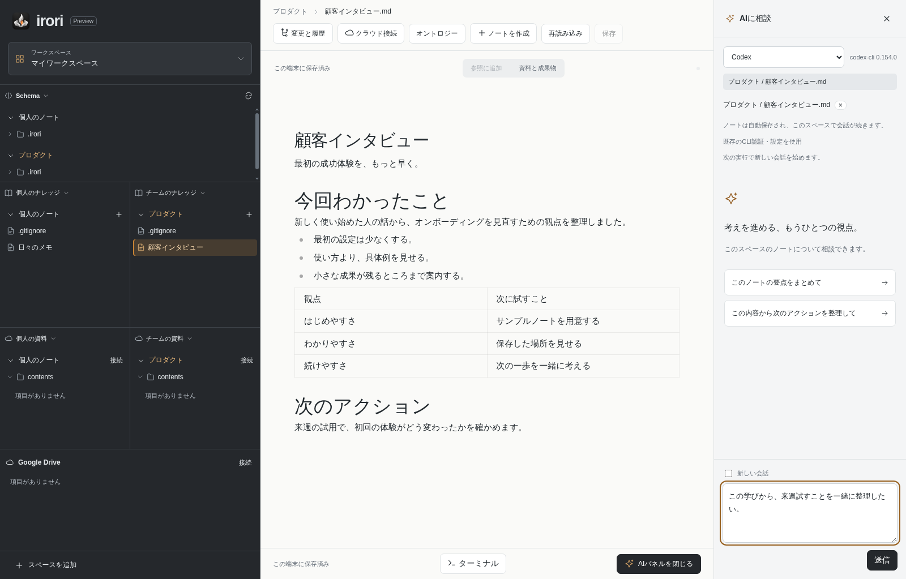

<div align="center">


# irori

**ノートから、次の仕事へ。**

ノートを書き、その続きをローカルの CLI エージェントと進める、知識のためのデスクトップ IDE/ADE。

**日本語** | [English](README.en.md)

<a href="https://del-taiseiozaki.github.io/irori/"></a>

[](https://github.com/DeL-TaiseiOzaki/irori/releases)
[](https://github.com/DeL-TaiseiOzaki/irori/actions/workflows/app.yml)
[](LICENSE)
[](#ダウンロード)

[ダウンロードサイト](https://del-taiseiozaki.github.io/irori/) ・
[リリースノート](https://github.com/DeL-TaiseiOzaki/irori/releases) ・
[ドキュメント](#ドキュメント) ・
[Issues](https://github.com/DeL-TaiseiOzaki/irori/issues)



<sub>実際の開発画面です。表示内容は検証用のサンプルです。</sub>

</div>

---

## ダウンロード

配布の入口は **[ダウンロードサイト](https://del-taiseiozaki.github.io/irori/)** です。ブラウザで動くアプリではなく、パソコンにインストールして使います。

| プラットフォーム | 状態 | 取得先 |
| --- | --- | --- |
| **Windows 11 x64** | 検証版 preview（配布用署名なし） | [ダウンロードサイト](https://del-taiseiozaki.github.io/irori/) の Windows 用インストーラー .exe |
| **macOS（Apple Silicon）** | 検証版 preview（配布用署名なし） | [ダウンロードサイト](https://del-taiseiozaki.github.io/irori/) の Mac 用ディスクイメージ .dmg |
| Linux | 配布予定なし | [ソースから実行](#ソースから実行) |

- 公開中の版、各ファイルのサイズと SHA-256 は、[リリース一覧](https://github.com/DeL-TaiseiOzaki/irori/releases) の最新プレリリースにあるリリースノートと、添付の `SHA256SUMS.txt` にあります。
- 配布用の署名がないため、Windows は発行元を確認できない旨の警告を表示します。**Mac は初回起動が拒否されます。** 「システム設定 → プライバシーとセキュリティ」で irori のブロック通知の横の「このまま開く」を一度押してください。2 回目からは通常どおり開けます。
- Windows は AMD Ryzen・Intel の **x64 向け**で、Windows ARM 版ではありません。Mac は **Apple Silicon（M シリーズ）専用**です。Intel Mac には対応しません。
- Windows 11 / macOS 実機でのインストール・IME・CLI 連携の受け入れ確認は継続中です。まずは使い捨ての KB フォルダやコピーでお試しください。
- インストール済みのアプリでは「更新を確認」で新しい版が案内されます。main に入ったアプリの変更は検証版として速やかに公開し、1 時間を超えて未公開のままなら自動チェックが知らせます（[DISTRIBUTION](docs/DISTRIBUTION.md)）。

インストール後に必要なもの:

1. Git — ノートの履歴と共有に使います。Windows は [Git for Windows](https://git-scm.com/downloads/win)、Mac は [Git for macOS](https://git-scm.com/downloads/mac)。
2. 使いたい CLI（`claude` / `codex` / `opencode` / `pi`）を各サービスの手順でインストールし、ログインしておきます。AI の利用には各サービスの利用条件・料金が適用されます。ノート編集だけなら CLI の設定は不要です。
3. ノートを置く KB フォルダ（新規フォルダ、または既存の Git チェックアウト）。

## irori とは

- **ノートを書く。** 見たまま編集できる Markdown エディタ。自動保存、`_assets/` への画像貼り付け、Cmd/Ctrl+S での選択・undo 維持。Markdown ファイルが常に正本です。KB が `.irori/notes.json` で場所とテンプレートを宣言すれば、**今日のノート**が決まった場所に決まった形で開きます。
- **AI と続きを進める。** Claude Code・Codex・OpenCode・Pi を、選んだ作業場所でそのまま起動。インストール済み CLI と、その認証・設定をそのまま使います。irori は独自の API キーを要求しません。
- **知識のつながりを見る。** CSV を表とグラフで見渡し、宣言済みオントロジーを階層／サブグラフとして表示して、つながるノートへ移動できます。
- **手元に残る。** ノートは選んだフォルダの Markdown のまま。Git 操作、Google Drive 接続（読み取り専用の試験実装）、内蔵ターミナルはすべてアプリの中から扱えます。

## 使い方

1. 起動して **ワークスペースを選択**。**KBフォルダを開く** で既存のフォルダやチェックアウトを名前付きで登録します。**登録して開く** が `.irori/scope.json` を作成し、`/contents/` を `.gitignore` に追加します。既存の Markdown は移動しません。
2. ノートを開くか **ノートを作成**。ドキュメント表示のまま編集でき、画像はノート隣の `_assets/` に入ります。
3. **AIに相談** でハーネスを選び、指示を送信。実行中の要求・質問はパネルに表示され、**停止** でプロセスツリーを停止します。次の指示は **送信待ちに追加** で予約でき、会話は再起動後も復元されます（再開は明示操作）。
4. **ソース管理**（変更と履歴）で差分確認・ステージング・コミット。取得／受信／統合は明示的な確認付きで、自動 stash・hard reset・force push は行いません。
5. **クラウド接続** で Google アカウントとフォルダを登録（読み取り専用の接続試験）。Windows でのマウントには [WinFsp](https://winfsp.dev/rel/) が必要です。Mac は macOS の NFS マウントを使うため、追加のインストールは不要です。
6. 画面下の **ターミナル** で、その KB のフォルダからシェルを起動できます。

CLI 側のルール・設定・スキル・MCP の探索は各プロバイダの責任範囲です。ただし KB の `.agents/skills/` にあるスキルは、作成欄で選ぶと irori が依頼と一緒にどのハーネスにも渡します。irori が複数チームの指示をまとめて混ぜることはありません。登録は所有境界であり、OS サンドボックスではありません。

## 現在のステータス

公開中の配布物は **Windows x64 と macOS arm64 の、配布用署名がない検証版（preview）** です。完成版リリースではありません。

確認待ち・未実装の主な項目:

- Windows 11 / macOS 実機での受け入れ（インストール、IME、CLI 連携、GitHub 同期）
- 実アカウントでの Google 同意・ネイティブマウント、Drive への書き込み（現在は読み取り専用）
- OpenCode / Pi の実モデルターン受け入れ（ネイティブ制御テストは通過済み）
- 配布用の署名（Windows 署名と Apple の Developer ID 署名・notarization）、規模・性能、Markdown 保存範囲の拡大、端末をまたぐ履歴共有

判定済み・暫定・未着手の区別は [ACCEPTANCE](docs/ACCEPTANCE.md)、現在地は [STATUS](docs/STATUS.md)、配布の証跡は [CHECKPOINT](docs/CHECKPOINT.md) にあります。

## ソースから実行

開発者向けの手順です。利用するだけならインストーラーを使ってください。

必要環境: Node.js **24.15+（24.x）または 26+**、npm、デスクトップセッション。Pi は 0.85+ が必要で、ネイティブ制御の確認には OpenCode 1.18.30 / Pi 0.85.1 を使用しました（[ハーネス互換性](docs/HARNESSES.md)）。

```sh
git clone https://github.com/DeL-TaiseiOzaki/irori.git
cd irori
npm ci
npm run setup:electron
npm run build
npm start
```

`setup:electron` は固定版 Electron を取得します（npm のライフサイクルスクリプトを無効化している場合にも有効）。Windows・macOS も同じコマンドを各自のチェックアウトで実行します。

- **root ユーザーの Linux コンテナ**では、ビルド後に `npm run start:container` を使います。Chromium の OS サンドボックスを無効化する明示的なコマンドで、エージェントの権限方針は変更しません。通常のデスクトップでは非 root ユーザーで `npm start` を使ってください。
- **GUI が実際に見えること**が前提です。SSH やコンテナのシェルだけでは Electron のウィンドウは表示されません。Linux VM で試す場合は `npm run preview:vm`（[VM プレビュー](docs/VM-PREVIEW.md)）、ヘッドレス確認は `xvfb-run -a npm run test:ui` を使います。
- システムの Node が 20 のままだと `npm ci` が engine 警告を出しますが、以降の npm スクリプトは固定版 Node 24 を使います。Vite のチャンクサイズ警告もビルド失敗ではありません。

### 配布サイトのプレビュー

```sh
npm run dev:website      # ローカルプレビュー
npm run build:website    # dist-website/ に静的出力
```

`website/` が配布の入口です。デスクトップアプリをブラウザで動かすものではありません。公開手順は [DISTRIBUTION](docs/DISTRIBUTION.md) にあります。

### 検証

```sh
npm run build
npm test
# 実際の Electron。Linux CI では先に xvfb-run -a が必要:
npm run test:ui
# 実アカウントと使い捨て KB を使用。ネイティブアカウントの利用枠を消費します:
npm run test:agents
npm run test:lifecycle
# 両プロバイダを実際の UI で（POSIX の例）:
IRORI_UI_REAL_AGENTS=1 xvfb-run -a npm run test:ui
```

PowerShell では `$env:IRORI_UI_REAL_AGENTS="1"` を設定してからデスクトップで `npm run test:ui` を実行します。詳細な証跡は Git 管理外の `test-results/` に出力され、使い捨てディレクトリのみを変更します。

## 実装境界

- React レンダラー → 型付き・検証済みの `HostAPI` → Electron preload/main。レンダラーからの Node アクセス、生 IPC の公開、リモートページ遷移、ドキュメント内スクリプト実行は行いません。認証付きループバックの rclone サービスはホストのみが制御します。
- ドキュメント編集は Milkdown Crepe、その他のテキスト／CSV ソースは CodeMirror 6。Markdown が正本で、未対応ブロックは文字列のまま保持されます。
- Node の `FileService` が正規化パス、スコープ所有権、可搬 UUID 宣言、ローカルのバインディング／下書き／バックアップ、遅延ディレクトリ列挙、ウォッチャ、版を意識した書き込みを担当します。
- Codex はネイティブ app-server JSONL、Claude は Claude Agent SDK が未改変の `claude` 実行ファイルを制御します。セッションハンドルと表示履歴・保留メッセージは、スコープ UUID・プロバイダ・正規化チェックアウトルートに紐づけて端末データに保存されます。復元に失敗してもハンドルを保持し、黙って新しい会話に切り替えることはありません。
- 端末データは Electron 標準の `userData`（テストは `IRORI_DATA_DIR` で上書き）。ワークスペース選択、アカウントメタデータ、rclone 資格情報、クラウドバインディングはそこに残り、既存の `contents` のバイト列はセットアップで移動・削除されません。

設計判断は [ホスト決定 ADR 001](docs/decisions/001-initial-host.md) と [リリース・ワークスペース決定 ADR 002](docs/decisions/002-release-and-workspace.md) を参照してください。

## ドキュメント

| 目的 | ドキュメント |
| --- | --- |
| 配布と公開手順 | [DISTRIBUTION](docs/DISTRIBUTION.md) / [PACKAGING](docs/PACKAGING.md) / [RELEASE-PLAN](docs/RELEASE-PLAN.md) |
| 現在地と受け入れ範囲 | [STATUS](docs/STATUS.md) / [ACCEPTANCE](docs/ACCEPTANCE.md) / [CHECKPOINT](docs/CHECKPOINT.md) |
| 日々の編集と記録 | [DAILY-WORKFLOW](docs/DAILY-WORKFLOW.md) / [EDITING-AND-RECORDS](docs/EDITING-AND-RECORDS.md) / [RECOVERY-AND-NOTE-TOOLS](docs/RECOVERY-AND-NOTE-TOOLS.md) |
| エージェントと会話 | [HARNESSES](docs/HARNESSES.md) / [CONVERSATIONS](docs/CONVERSATIONS.md) / [WORKSPACE-CONNECTIONS](docs/WORKSPACE-CONNECTIONS.md) |
| Git とクラウド | [GIT](docs/GIT.md) / [CLOUD-SETUP](docs/CLOUD-SETUP.md) / [WORKSPACE-DRIVE](docs/WORKSPACE-DRIVE.md) / [DISTRIBUTOR-GOOGLE](docs/DISTRIBUTOR-GOOGLE.md) |
| 画面と知識の表示 | [UI-DESIGN](docs/UI-DESIGN.md) / [LAYERED-EXPLORER](docs/LAYERED-EXPLORER.md) / [ONTOLOGY](docs/ONTOLOGY.md) / [KB-SEARCH](docs/KB-SEARCH.md) / [NOTE-LINKS](docs/NOTE-LINKS.md) / [KNOWLEDGE-NAVIGATION](docs/KNOWLEDGE-NAVIGATION.md) / [TERMINAL](docs/TERMINAL.md) |
| 開発環境 | [VM-PREVIEW](docs/VM-PREVIEW.md) / [互換性マトリクス](docs/compatibility/MATRIX.md) / [計測](docs/measurements/2026-09-12.md) |

開発を引き継ぐ場合は [HANDOFF](docs/HANDOFF.md) と [継続プロンプト](docs/HANDOFF-PROMPT.md) から始めてください。コントリビューターの取り決めは [AGENTS.md](AGENTS.md) にあります。

## 不具合の報告

[GitHub Issues](https://github.com/DeL-TaiseiOzaki/irori/issues) に、表示されているバージョン・OS・実際のメッセージを添えてお知らせください。ノートの本文、認証情報、OAuth の URL は載せないでください。

## ライセンス

[MIT License](LICENSE)。依存ライブラリはそれぞれの条件に従います（[THIRD_PARTY_NOTICES](docs/THIRD_PARTY_NOTICES.md)）。
