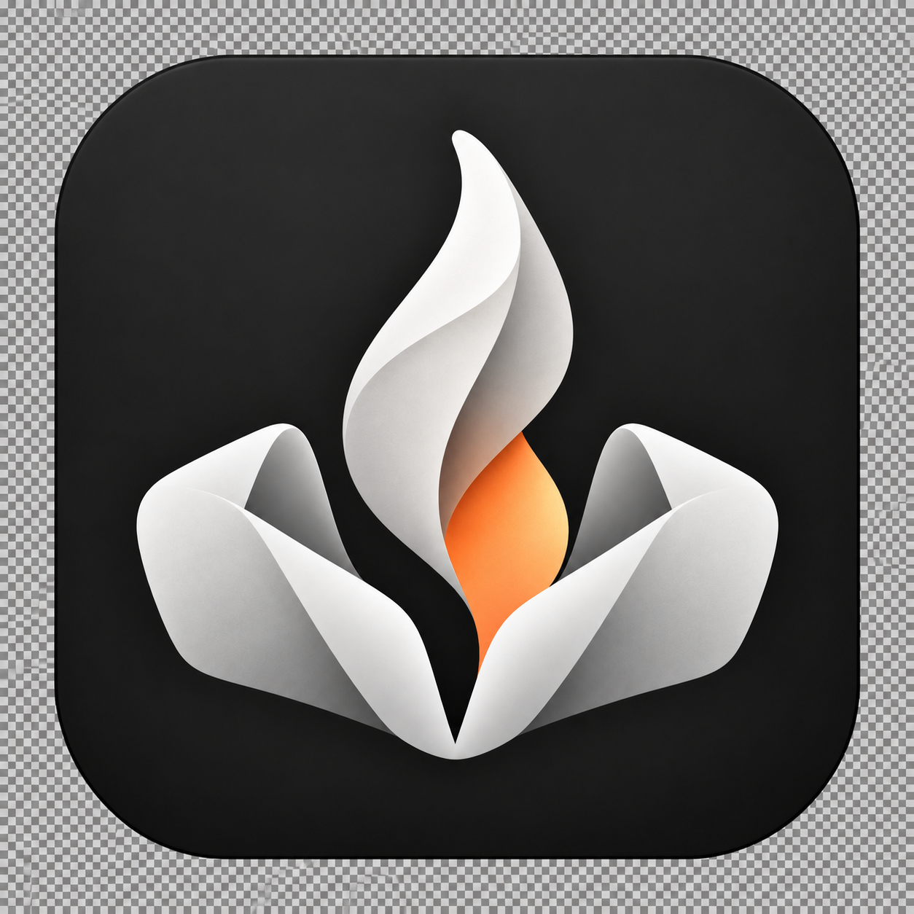
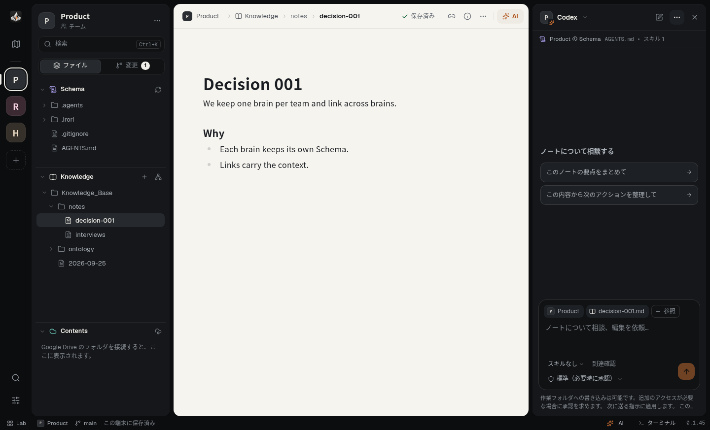
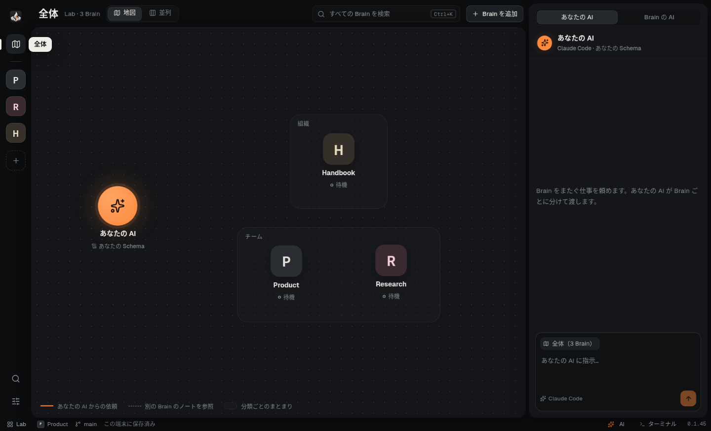

<div align="center">



# irori

**ノートから、次の仕事へ。**

知識を書きためるノートと、その続きを進めるローカルの AI エージェントを、ひとつの画面にまとめたデスクトップアプリです。

**日本語** | [English](README.en.md)

<a href="https://del-taiseiozaki.github.io/irori/"></a>

[](https://github.com/DeL-TaiseiOzaki/irori/releases)
[](https://github.com/DeL-TaiseiOzaki/irori/actions/workflows/app.yml)
[](LICENSE)
[](#ダウンロード)

[ダウンロード](https://del-taiseiozaki.github.io/irori/) ・
[リリースノート](https://github.com/DeL-TaiseiOzaki/irori/releases) ・
[はじめかた](#はじめかた) ・
[フィードバック](#フィードバック) ・
[開発に参加する](#開発に参加する)



</div>

---

irori は、Markdown のノートを中心に仕事を進めるための **知識の IDE / ADE** です。

ノートを置いたフォルダを **Brain**（知識ベース）として開くと、ノートの編集、資料の閲覧、Git での記録、Google Drive の資料までをひとつの画面で扱えます。そのうえで、パソコンに入っている **Claude Code・Codex・OpenCode・Pi** を、その Brain の中でそのまま動かし、ノートの続きを頼めます。

ノートはいつでも手元のフォルダにある普通の Markdown ファイルです。AI は各 CLI の認証と設定をそのまま使うため、irori 独自のアカウントや API キーは要りません。

## ダウンロード

**[ダウンロードサイト](https://del-taiseiozaki.github.io/irori/)** からインストーラーを入手してください。

| プラットフォーム | ファイル |
| --- | --- |
| **Windows 11**（x64） | インストーラー `.exe` |
| **macOS**（Apple Silicon） | ディスクイメージ `.dmg` |

- 現在は **検証版（preview）** で、配布用の署名はありません。
  - Windows では「発行元を確認できません」という警告が出ます。
  - Mac では初回の起動が止められます。「システム設定 → プライバシーとセキュリティ」で「このまま開く」を一度押してください。
- 一度入れれば、新しい版が出たときにアプリが知らせてくれます。「更新して再起動」を押すだけで更新できます。
- Windows ARM 版と Intel Mac には対応していません。Linux ではソースから実行できます（[開発ガイド](docs/DEVELOPMENT.md)）。

## はじめかた

1. **準備する。** [Git](https://git-scm.com/downloads) を入れます。AI を使う場合は、使いたい CLI（`claude` / `codex` / `opencode` / `pi`）もインストールしてログインしておきます。ノートを書くだけなら CLI は要りません。
2. **Brain を追加する。** 起動画面の **KBフォルダを開く** で手元のフォルダを選ぶか、**GitHub から取得** でリポジトリをクローンします。既存のファイルは移動しません。
3. **ワークスペースを作る。** 使う Brain にチェックを入れて **ワークスペースを作成** を押します。個人・チーム・組織の Brain を自由に組み合わせられます。
4. **書いて、頼む。** ノートを開いて書き、右上の **AIに相談** から AI に続きを依頼します。AI が許可を求めたときは、パネルに確認が表示されます。

## 主な機能

**Brain とワークスペース**
- Brain は **Schema**（AI への指示やスキル）・**Knowledge**（ノート）・**Contents**（資料）の 3 つの層で整理されます。
- **全体** 画面で、ワークスペース内の Brain を地図または並列で見渡せます。検索もすべての Brain をまたいでできます。
- Brain ごとに名前・分類・アイコン・色を設定できます。

**ノート**
- 見たまま編集できる Markdown エディタです。自動で保存し、画像を貼り付けるとノートの隣の `_assets/` に入ります。
- 相対リンクをたどったり、参照元（バックリンク）を一覧したりできます。名前や場所を変えると、リンクも一緒に書き換わります。
- **今日のノート** を、決めた場所とテンプレートで開けます。
- CSV は表で表示できます。オントロジーは階層やグラフとして表示できます。

**AI エージェント**
- **Brain の AI**：Claude Code・Codex・OpenCode・Pi を、その Brain の Schema を読み込んだ状態で起動します。複数の Brain の AI を同時に動かせます。
- **あなたの AI**：Brain をまたぐ仕事を頼めます。依頼を Brain ごとに分けて各 Brain の AI に渡し、結果をまとめて報告します（現在は Claude Code に対応）。
- 許可の扱いは各 CLI の設定に従います。Claude Code と Codex では、標準（必要なときに承認）かフルアクセスかを選べます。
- AI への指示は送信待ちとして予約でき、会話は再起動しても残ります。

**資料**
- PDF・Word（.docx）・PowerPoint（.pptx）・Excel などのスプレッドシート（.xlsx/.xlsm/.xls/.ods）・画像を、外部アプリに切り替えず画面内で表示します。表示専用で、編集は元のアプリで行います。
- Google Drive のフォルダを Brain の Contents として接続できます。irori からも、その Brain の AI からも編集でき、変更は Drive に送られます。Windows では [WinFsp](https://winfsp.dev/rel/) が必要です。

**記録と道具**
- **変更** タブで差分の確認・コミット・履歴の閲覧ができます。強制的な上書きや自動の stash は行いません。
- Brain のフォルダで開く内蔵ターミナルがあります。
- テーマ（システムに合わせる・いろり・ライト・ダーク）、Markdown のフォント、表示言語（日本語 / English）を切り替えられます。

<div align="center">

</div>

## 現在の状態

irori は **検証版（preview）** です。main に入った変更は検証版としてすぐに公開しています。

- Windows 11 / macOS の実機での受け入れ確認（インストール、日本語入力、CLI 連携、Google Drive）を続けています。まずは使い捨てのフォルダやコピーでお試しください。
- 配布用の署名（Windows の署名、Apple の Developer ID・notarization）は未対応です。

詳しい進み具合は [STATUS](docs/STATUS.md)、確認済みの範囲は [ACCEPTANCE](docs/ACCEPTANCE.md) にあります。

## フィードバック

- 不具合の報告や要望は [GitHub Issues](https://github.com/DeL-TaiseiOzaki/irori/issues) へお願いします。
- 報告には、画面に表示されているバージョン・OS・実際のメッセージを添えてください。
- ノートの本文、認証情報、OAuth の URL は載せないでください。

## 開発に参加する

ソースからの実行、検証の手順、設計の記録は **[開発ガイド（docs/DEVELOPMENT.md）](docs/DEVELOPMENT.md)** にまとめています。

```sh
git clone https://github.com/DeL-TaiseiOzaki/irori.git
cd irori
npm ci
npm run setup:electron
npm run build
npm start
```

- Node.js 24.15 以上（24.x）または 26 以上が必要です。
- コントリビューターの取り決めは [AGENTS.md](AGENTS.md) にあります。
- 開発を引き継ぐ場合は [HANDOFF](docs/HANDOFF.md) から始めてください。

## 関連プロジェクト

- [irori-templete](https://github.com/DeL-TaiseiOzaki/irori-templete)：irori で使う Brain（知識ベース）のおすすめテンプレートです。

## ライセンス

[MIT License](LICENSE)。依存ライブラリはそれぞれのライセンスに従います（[THIRD_PARTY_NOTICES](docs/THIRD_PARTY_NOTICES.md)）。
