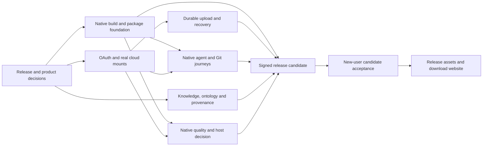

# Release readiness and remaining work

Implementation update: native Forge CI passes on Linux x64, Windows x64 and Mac arm64 at `713222a`. [Workspace Drive](WORKSPACE-DRIVE.md) is independent of KB membership. [Ontology presentation](ONTOLOGY.md) adds CSV table/source editing, declared column mappings, hierarchy/subgraph graphs and note links. D06 still requires note/artifact/run identities, selected-source version retention/provenance, search and reverse links; these changes do not waive D03–D10 gates.

Reviewed: 2026-09-13, against pushed checkpoint `ce7234b`. This plan treats deployment as the currently agreed public website plus installable Windows/macOS desktop application. It preserves the full first-release requirements; an earlier limited beta would be a separate scope decision. It does not introduce a hosted application backend, billing system or realtime collaboration service.

Implementation follow-up: [ADR 002](decisions/002-release-and-workspace.md) closes Q01/Q02 and the MIT license decision, and names Windows 11 x64 and MacBook M5 Pro arm64 as acceptance devices. Q02 is implemented for new connections: repositories and Drive folders attach independently to a workspace, including an empty workspace. Existing KB attachments remain intact; explicit legacy-transfer tooling remains open. D02 now has Forge packaging, verification/native-package CI, an isolated packaged-app smoke test and dependency/checksum evidence. See [packaging evidence](PACKAGING.md). Native CI and installed-device acceptance must be reported separately. The starting-point table below describes `ce7234b`, not this follow-up.

## Verified starting point

| Area             | Observed state                                                                                                                                                                                       |
| ---------------- | ---------------------------------------------------------------------------------------------------------------------------------------------------------------------------------------------------- |
| Repository       | Public; `main` contains `ce7234b`; GitHub reports no license                                                                                                                                         |
| GitHub Pages     | `has_pages: false`; no website deployed through this repository                                                                                                                                      |
| Releases         | No GitHub releases or installer assets                                                                                                                                                               |
| Actions          | Only the manual **Publish download website** workflow; zero workflow runs; no application verification or installer workflow                                                                         |
| Website manifest | Version and all three downloads are `null`: Windows x64, macOS arm64, macOS x64                                                                                                                      |
| Desktop          | Notes, scoped workspaces, Git collaboration, four harness adapters and read-only cloud connection code implemented                                                                                   |
| Desktop evidence | Previous checkpoint passed build, 54 tests with native controls, and five Electron UI suites in Linux. Those results do not establish Windows/macOS, live cloud mounts or every native model journey |
| Website evidence | `npm run build:website` and `xvfb-run -a npm run test:website` rerun successfully during this planning pass; current page correctly leaves downloads unavailable                                     |

Remote state was read through GitHub's repository, releases, workflows and workflow-runs APIs. No publishing settings, release, OAuth account or workflow run was changed. See [distribution](DISTRIBUTION.md), [acceptance](ACCEPTANCE.md), [harness evidence](HARNESSES.md) and [reuse completion](REUSE-COMPLETION-2026-09-13.md).

## Release levels

| Milestone                          | What is being offered                                                  | Required gate                                                                                                                                                                            |
| ---------------------------------- | ---------------------------------------------------------------------- | ---------------------------------------------------------------------------------------------------------------------------------------------------------------------------------------- |
| Public information page            | Product introduction, development status and setup/support information | Correct public claims, verified static build, Pages setup and published browser check. Downloads can remain unavailable                                                                  |
| Limited beta, if explicitly chosen | A clearly stated subset for named supported platforms/capabilities     | Installable tested package, native data/permission/lifecycle checks for every enabled feature, onboarding and support. Missing cloud/ontology/provenance cannot be presented as complete |
| First complete release             | The full agreed knowledge workspace                                    | All mandatory rows below and the end-to-end acceptance journey. Read-only cloud access or note editing alone is insufficient                                                             |

The existing specification includes ontology editing and source-linked artifacts, alongside personal/team spaces, GitHub, selected Drive folders and native agents. Its cloud contract includes recoverable writes and observed remote completion. Do not silently defer these requirements just because packaging is now the next operational task. Optional terminal functionality and automatic updates need explicit release disposition; a tested manual upgrade path can form the initial update strategy.

## Ordered work packages

Priority indicates when to start reducing uncertainty, not that every task is strictly sequential. Engineering can proceed alongside owner-controlled account and product decisions.

| ID / priority                | Remaining work and current gap                                                                                                                                                                                                                           | Completion evidence                                                                                                                                                                                                                                                                                                                                                                       | Dependencies / ownership                                                                                                                                            |
| ---------------------------- | -------------------------------------------------------------------------------------------------------------------------------------------------------------------------------------------------------------------------------------------------------- | ----------------------------------------------------------------------------------------------------------------------------------------------------------------------------------------------------------------------------------------------------------------------------------------------------------------------------------------------------------------------------------------- | ------------------------------------------------------------------------------------------------------------------------------------------------------------------- |
| D01 / P0                     | Finalize minimum OS versions and enabled-feature/support matrix; MIT, Q01/Q02 and initial CPU/device decisions are recorded                                                                            | Recorded decisions and an explicit enabled-feature/support matrix. Windows and an actual MacBook remain required; do not enable an untested Intel/ARM download                                                                                                                                                                                                                            | Product owner + engineering; start immediately                                                                                                                      |
| D02 / P0                     | Establish clean builds and packaging. Forge and verification/native package CI are implemented; close remaining native package checks and installed-device acceptance; reuse Electron Forge if Electron remains selected, rather than write installer orchestration                                           | Clean CI checkout builds/tests; Windows/macOS test installers launch without developer Node/npm. Include `dist`, `dist-host`, assets and all host runtime dependencies, including dynamically imported SDKs; exclude KBs, `.local`, test logs and credentials                                                                                                                             | Engineering; provisional packaging can start before final host decision in D07                                                                                      |
| D03 / P0                     | Prepare distributor Google OAuth configuration and native rclone prerequisites; replace developer environment-variable setup with a supported first-run distribution path                                                                                | Two real accounts and a shared drive connect on Windows/Mac; folder names/IDs persist; CLI reads actual mounted files; disconnect/reconnect, denial, expiry and missing prerequisites recover visibly                                                                                                                                                                                     | Owner supplies OAuth project/access; engineering implements setup; native Windows/Mac environments. Start early alongside D02                                       |
| D04 / P1                     | Complete cloud writes and recovery. Current OAuth scope and mounts are read-only. Add per-connection durable staging, upload observation, restart recovery, remote refresh, moved-folder rebinding and Google-native document handling                   | Separate pending/uploading/remote-confirmed/failed states; power/network interruption preserves unsent bytes; no fallback local contents folder; independent Git/Drive failures; actual remote version/bytes confirmed                                                                                                                                                                    | D03; engineering. Scope changes require re-consent/verification assessment                                                                                          |
| D05 / P1                     | Close native agent/Git acceptance and onboarding. Four adapters exist; full real model/resume and native-platform acceptance do not                                                                                                                      | Every advertised harness: clean GUI PATH detection, native login/help, streamed work, supported questions/denials, cancellation, crash and restart/resume, version mismatch, rules/skills/MCP/extensions and mounted-file access. Git: real clone/fetch/commit/push, expiry, denied branch protection, divergence/merge and recovery on each OS                                           | D02–D03; native devices, test GitHub/Drive resources and authorized native model execution. Do not replace native evidence with protocol fixtures                   |
| D06 / P1                     | Complete search, rename/backlinks/properties, explicit multi-source selection, stable note/artifact/run IDs, retained source-version/provenance records and reverse navigation; CSV ontology presentation is implemented | CSV basic editing, note links and hierarchy/subgraph graph presentation preserve unknown columns/IDs. Existing notes are not bulk-rewritten. Produce/register a real artifact, including the specified PPTX case, from observed source versions; preserve prior runs, dirty-source snapshots, moved/missing references and manual partial evidence; cross-scope sharing is explicit                                                            | Q01/Q02 are recorded in ADR 002. Identity/source-record work can proceed with D03–D05; final cloud/Git publication acceptance depends on D04–D05                                   |
| D07 / P1                     | Finish native editor, data safety and performance. Electron remains provisional and Linux memory exceeds proposed budgets                                                                                                                                | Windows/Mac Japanese IME, undo/redo, slash/block/table/image/paste behavior, keyboard/screen-reader checks, unknown Markdown preservation, external/multiple-instance edits, crash/recovery, offline rebind/remove and mount invalidation. Exercise 15,118 files / five spaces. Close the comparable-host decision with measured editor/agent/mount costs and accepted or revised targets | Native devices, D02–D03; shared editor/data work can run independently of ontology. Tauri comparison is evidence gathering; a rewrite is not automatically required |
| D08 / P1                     | Prepare distribution identities and release operations: signing/notarization, actual packaged dependency/provider notice review, native credential protection, support/privacy documentation, upgrade/rollback policy                                    | Signed release candidates install from a browser download; platform prompts/notarization pass; native credential storage/ACLs are tested; logs can be shared without credentials or transcripts; upgrades and rollback retain KBs/device metadata; actual authentication/distribution routes are cleared                                                                                  | Owner-controlled signing accounts/credentials and license decision; final candidate depends on D02 and product/quality gates. Start obtaining identities early      |
| D09 / release candidate gate | Run the complete new-user journey against the signed candidate and record the release decision before public downloads                                                                                                                                   | On supported Windows and Mac hardware, a new user installs, configures dependencies/accounts through the documented UI, completes the journey below and recovers from individual service failures; evidence is tied to the exact release commit/package                                                                                                                                   | D01–D08; product owner and representative non-engineer trial                                                                                                        |
| D10 / final publication      | Wire public delivery: Pages configuration, workflow execution, exact release assets and website manifest; revise website copy, screenshots and tests for available downloads                                                                             | Tagged release with exact version, verified per-architecture assets, sizes/checksums, release notes and support links. Signed-out browser downloads and installs the correct binary. Page and package version agree; unready architectures remain disabled                                                                                                                                | D08–D09 for application downloads. Information-page publication can happen earlier after D01 and page checks                                                        |

Existing Git functionality should be verified and extended only where the release workflow requires it. Branch creation/rebase/binary-conflict editing remain visible backlog items; this plan does not turn them into prerequisites for the already implemented ordinary review/merge/share flow. Unknown/conflicting files must still fail safely and provide a usable recovery route.

## Specific issues found while preparing this plan

1. **Download-state testing is implemented.** `scripts/website-smoke.ts` checks the real manifest and isolated unavailable, mixed and available builds. Build-time schema validation rejects mismatched installer extensions. Published-link verification still belongs to D10.
2. **Forge packaging is implemented.** `scripts/build-host.mjs` externalizes runtime dependencies; Forge includes pruned production dependencies. The packaged Linux executable passes outside-checkout launch, OpenCode/Claude SDK loading and Japanese note save. Native installers and clean-device acceptance still need their corresponding evidence.
3. **Google access is intentionally read-only today.** `src/cloud/accounts.ts` requests `drive.readonly`; upload work needs an explicit authorization/capability change as well as mount/VFS code. This scope is classified as restricted by Google. Resolve public-app verification, published privacy information and the data-flow assessment early; choosing a folder in irori's UI does not itself narrow the granted OAuth scope. [Google Drive authorization scopes](https://developers.google.com/workspace/drive/api/guides/api-specific-auth)
4. **OAuth configuration needs an installed-app design.** The current environment-variable setup is a development entry point. Follow the supported desktop/system-browser flow, verify rclone's authorization behavior and token refresh, and specify how distributor configuration reaches the installed host. Never ask each ordinary user to create an OAuth application. [Google desktop OAuth](https://developers.google.com/identity/protocols/oauth2/native-app)
5. **Publication remains separate from package CI.** Pages is disabled and its workflow is manual. The new desktop workflow verifies code and creates unsigned engineering artifacts, without publishing releases or website downloads. Enabling the Pages GitHub Actions source precedes its first successful deployment. [GitHub Pages workflows](https://docs.github.com/en/pages/getting-started-with-github-pages/using-custom-workflows-with-github-pages)
6. **Historical status needed reconciliation.** This planning pass updates the cloud/compatibility summaries to reflect implemented Git collaboration and private metadata fsync. Use the current checkpoint and this plan instead of treating earlier dated milestone backlogs as the current implementation state. File fsync does not prove complete crash consistency or remove the external-writer race.

Electron recommends Forge for packaging, and documents Windows/macOS signing as part of distribution. Evaluate those existing tools against the actual package contents and native architectures. [Electron packaging](https://www.electronjs.org/docs/latest/tutorial/application-distribution), [code signing](https://www.electronjs.org/docs/latest/tutorial/code-signing)

## Dependencies and immediate execution order

Start engineering with **D02 and the native D03/D05 feasibility checks**, while the owner resolves D01 and obtains OAuth/signing access. This exposes deployment constraints before more UI work accumulates. Start stable identity/context work from D06 alongside them; the ontology CSV/graph presentation follows ADR 002. Signing-account setup and the public support/privacy page can start early even though the signed candidate comes later.

An earlier information page is a small independent deliverable. A limited beta can shorten the path only through a recorded scope decision and honest disabled-feature/support claims; it does not complete the full specification.

## Owner decisions and external inputs

- Q01 is CSV basic editing with note links and hierarchy/subgraph visualization; native agents build the ontology with people. Q02 is multiple independent GitHub repositories and selected Drive folders in one workspace, with multiple accounts and no required category reasoning. New workspace-owned connections are implemented; retain existing KB attachments until an explicit legacy-transfer flow is available.
- Acceptance devices are Windows 11 Ryzen 9/x64 and MacBook M5 Pro/arm64. Record their exact OS versions and tested minimums; macOS Intel remains unavailable without separate evidence.
- MIT is selected. Preserve full release scope unless the owner separately chooses a beta; publisher identity, public support contact and optional-terminal disposition still need release records.
- Supply access to the Google OAuth project and the selected code-signing/developer-account route. Their availability was not established merely by inspecting this checkout; no secret values belong in this plan.
- Provide native devices/test accounts and authorize real model execution when that test stage is scheduled. Windows/macOS and Google review turnaround cannot be estimated from Linux fixtures.

An accurate release-date estimate should follow D01 and the first native packaging/cloud/agent trials, because those determine the remaining implementation and external lead times.

## Complete first-release acceptance journey

A new user installs on Windows and an actual supported MacBook; adds several independent GitHub KBs to a workspace without mandatory personal/team/organization classification; edits/finds/links Japanese notes and declared CSV ontology with hierarchy/subgraph display; independently connects two Google accounts with selected My Drive/shared-drive folders; uses Codex, Claude Code and every additional advertised harness through their native accounts; curates a source with a retained source-version reference; creates/registers an artifact with immutable producing-run/source links; confirms Drive delivery independently from GitHub sharing; and recovers local or pending work when GitHub, Drive or an AI provider fails. None of the ordinary steps requires composing shell commands.

After the release candidate passes, the final external steps are: publish the verified release assets, set exact entries in `website/releases.json`, publish the website, verify signed-out downloads/installations, and announce the precise supported version. Keep a tested previous installer/manifest and document metadata compatibility for rollback.

## Requirement coverage

| Requirement                                        | Work packages                                                                      |
| -------------------------------------------------- | ---------------------------------------------------------------------------------- |
| R01 installed Windows/Mac application              | D01, D02, D08–D10                                                                  |
| R02 responsiveness and resource use                | D07                                                                                |
| R03 Markdown experience                            | D06–D07                                                                            |
| R04 native harnesses                               | D05, D08                                                                           |
| R05 terminal-free ordinary use / optional terminal | D02, D05, D09–D10; explicit optional-terminal disposition in D01                   |
| R06 multiple scoped spaces                         | D05–D07, D09–D10                                                                   |
| R07 GitHub and cloud folders                       | D03–D05, D09–D10                                                                   |
| R08 ontology, notes and artifacts                  | D06                                                                                |
| R09 versioned many-to-many lineage                 | D06, D04–D05 recovery gates                                                        |
| R10 arbitrary formats and handling boundaries      | D03, D06–D07                                                                       |
| R11 LayeredKB ownership/reference discipline       | D03–D07, D09–D10                                                                   |
| R12 practical reuse                                | Completed audit supplies the foundation; D02 uses established distribution tooling |

The original planning pass performed no deployment or feature implementation. The follow-up adds packaging/CI and download-state tests; [PACKAGING](PACKAGING.md) records its evidence and remaining gates. No release or Pages deployment is included.
